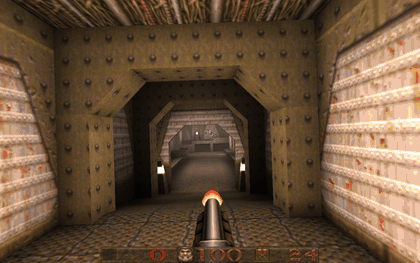

# cortex-actor

[](https://github.com/kvark/cortex-actor/actions/workflows/ci.yml)

Cortex is a compact behavioral-cloning game policy: **10.98M trainable parameters** over frozen [DINOv3 ViT-S+/16](https://huggingface.co/facebook/dinov3-vits16plus-pretrain-lvd1689m) features (39.7M parameters executed per decision including the frozen encoder). Trained with pure behavior cloning on the ~475-hour Quake subset of the public [Pixels2Play corpus](https://huggingface.co/datasets/elefantai/p2p-full-data) on a single consumer GPU, it reaches deeper engine-verified route progress on Quake E1M1 than the released P2P-150M and NitroGen (~500M) generalist gaming agents evaluated under the same protocol.

[](https://youtu.be/Ou9NAmFoCOM)

*The production checkpoint playing E1M1 from a fresh spawn — [full run on YouTube](https://youtu.be/Ou9NAmFoCOM).*

## Architecture

Per 100 ms decision: each 640×400 frame is encoded by frozen DINOv3 into a CLS token plus an ordered 5×8 spatial sample of the 25×40 patch grid (41 tokens × 384-d). The last 4 frames (300 ms) pass through a 6-layer, 384-d, 6-head bidirectional transformer encoder; the last frame's CLS position feeds two heads: 36 independent held-state logits (33 keys + 3 mouse buttons, absolute state, temperature-1 sampled at deploy) and tanh-squashed continuous mouse dx/dy. There is no previous-action input, pose, map, text, auxiliary loss, or game-specific rule.

## Weights

The trained Quake checkpoint is published at **[huggingface.co/mad-bot/cortex](https://huggingface.co/mad-bot/cortex)** (`cortex_quake_bc.pt`, fp32, 43.9 MB — weights, architecture arguments, and the embedded action schema; the frozen DINOv3 encoder is downloaded separately).

## Usage

```python
import torch
from huggingface_hub import hf_hub_download
from cortex_actor import Cortex, cortex_from_args, N_HELD_STATE

path = hf_hub_download("mad-bot/cortex", "cortex_quake_bc.pt")
ck = torch.load(path, map_location="cpu", weights_only=False)
model = cortex_from_args(ck["args_dict"])
model.load_state_dict(ck["model"])
model.eval()
# Inputs per step: cls (B, T, 384) and patches (B, T, 5, 8, 384) from frozen
# DINOv3 ViT-S+/16 at 640x400; see the paper for the deploy loop contract.
```

The action-channel contract (key roster, held-state layout, mouse scales) lives in `cortex_actor/schema.py`; the index of a key in `KEYS` is its channel in the logits tensor, so the file is part of the architecture.

`scripts/export_checkpoint.py` converts a training checkpoint into the release form (weights + contract only, local paths scrubbed).

## Results

On Quake E1M1 under an engine-verified evaluation protocol (completion counted only on the engine's level-transition event; N=20 stochastic episodes across 5 seeds, independently replicated), Cortex passes the opening door–button–gate sequence 20/20 and reaches route waypoint median 5–6 (max 9) with 28–32 kills per batch. The released P2P-150M and NitroGen baselines, run in the same environment with their official inference code and published settings at matched duration, stall at route waypoint median 1. Results generalize across additional maps and shared mid-map start states. No system, including ours, completes the level. Full numbers, controls, and negative results are in the paper: [**Cortex: An 11M-Parameter Specialist Policy Outperforms Foundation-Scale Gaming Agents on Quake**](paper/cortex_quake_bc.md).

## License

MIT. The DINOv3 encoder is downloaded separately from Meta under its own license; the Pixels2Play corpus belongs to Elefant AI.
