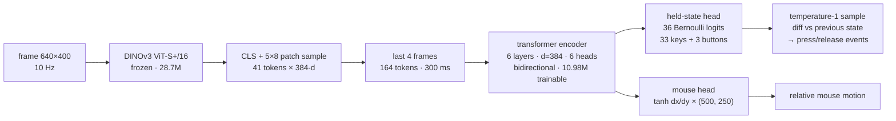

# cortex-actor

[](https://arxiv.org/abs/2607.22739)
[](https://github.com/kvark/cortex-actor/actions/workflows/ci.yml)

Cortex is a compact behavioral-cloning game policy: **10.98M trainable parameters** over frozen [DINOv3 ViT-S+/16](https://huggingface.co/facebook/dinov3-vits16plus-pretrain-lvd1689m) features (about 39.7M parameters executed per decision including the frozen encoder). It is trained on the ~474.7-hour Quake subset of the public [Pixels2Play corpus](https://huggingface.co/datasets/elefantai/p2p-full-data). In our time-controlled E1M1 harness, two N=20 Cortex batches reliably reach the opening route regions and fight enemies, while five-episode released P2P-150M and NitroGen reference batches remain shallower. No evaluated system completes the level. The paper states the small-sample, native-interface, and custom NitroGen-adapter limitations explicitly.

[](https://youtu.be/Ou9NAmFoCOM)

*The production checkpoint playing E1M1 from a fresh spawn — [full run on YouTube](https://youtu.be/Ou9NAmFoCOM).*

## Architecture

Per 100 ms decision: each 640×400 frame is encoded by frozen DINOv3 into a CLS token plus an ordered 5×8 spatial sample of the 25×40 patch grid (41 tokens × 384-d). The last 4 frames (300 ms) pass through a 6-layer, 384-d, 6-head bidirectional transformer encoder; the last frame's CLS position feeds two heads: 36 independent held-state logits (33 keys + 3 mouse buttons, absolute state, temperature-1 sampled at deploy) and tanh-squashed continuous mouse dx/dy. There is no previous-action input, pose, map, text, auxiliary loss, or game-specific rule.



## Weights

The trained Quake checkpoint is published at **[huggingface.co/mad-bot/cortex](https://huggingface.co/mad-bot/cortex)** (`cortex_quake_bc.pt`, fp32, 43.9 MB — weights, architecture arguments, and the embedded action schema; the frozen DINOv3 encoder is downloaded separately).

## Usage

```python
from cortex_actor import from_hub

model, ck = from_hub("mad-bot/cortex")  # needs huggingface_hub
# Inputs per step: cls (B, T, 384) and patches (B, T, 5, 8, 384) from frozen
# DINOv3 ViT-S+/16 at 640x400; ck["action_schema"] holds the channel contract.
# See the paper for the deploy loop.
out = model(cls, patches=patches)
```

The action-channel contract (key roster, held-state layout, mouse scales) lives in `cortex_actor/schema.py`; the index of a key in `KEYS` is its channel in the logits tensor, so the file is part of the architecture.

`scripts/export_checkpoint.py` converts a training checkpoint into the release form (weights + contract only, local paths scrubbed).

## Results

On Quake E1M1 under an engine-observed evaluation protocol (completion counted only on the engine's level-transition event), two independent N=20 Cortex batches reach pose proxies for the opening door, button room, and gate descent in 20/20 episodes. Their route-waypoint medians are 5 and 6 (maximum 9), with 28–32 kills per batch. Matched-duration released P2P-150M and NitroGen reference batches ($N=5$ each) have route median 1 and complete 0/5 episodes; Cortex also completes 0/20 in each batch. The route measure is heuristic, the reference batches are small, and NitroGen uses our custom gamepad-to-Quake adapter. Additional-map and mid-map results are mixed rather than a generalization claim. See the paper on [arXiv](https://arxiv.org/abs/2607.22739), or in this repository as [PDF](paper/cortex_quake_bc.pdf) or [Markdown](paper/cortex_quake_bc.md), plus the [machine-readable results](paper/results_data.json) and the exact [instrumented vkQuake source](https://github.com/kvark/vkQuake/tree/def85227e6089231f23c1fbc2ba5e9c454add833).

The upload-ready arXiv source bundle and its checksum are in
[paper/releases](paper/releases).

## Citation

If you use Cortex, its checkpoint, or these results, please cite the paper:

> Dzmitry Malyshau. *Cortex: Compact Behavior Cloning for Quake with Frozen Visual Features.* arXiv:2607.22739, 2026.

```bibtex
@misc{malyshau2026cortex,
  title         = {Cortex: Compact Behavior Cloning for Quake with Frozen Visual Features},
  author        = {Malyshau, Dzmitry},
  year          = {2026},
  eprint        = {2607.22739},
  archivePrefix = {arXiv},
  primaryClass  = {cs.CV},
  doi           = {10.48550/arXiv.2607.22739},
  url           = {https://arxiv.org/abs/2607.22739}
}
```

The evaluated artifacts are versioned separately from the manuscript: the original submission is frozen at [`paper-v1`](https://github.com/kvark/cortex-actor/tree/paper-v1), the compact latency-augmented revision with final author metadata at [`paper-v2.2`](https://github.com/kvark/cortex-actor/tree/paper-v2.2), and the exact evaluated weights are the checkpoint on [Hugging Face](https://huggingface.co/mad-bot/cortex).

## License

MIT. The DINOv3 encoder is downloaded separately from Meta under its own license; the Pixels2Play corpus belongs to Elefant AI.
