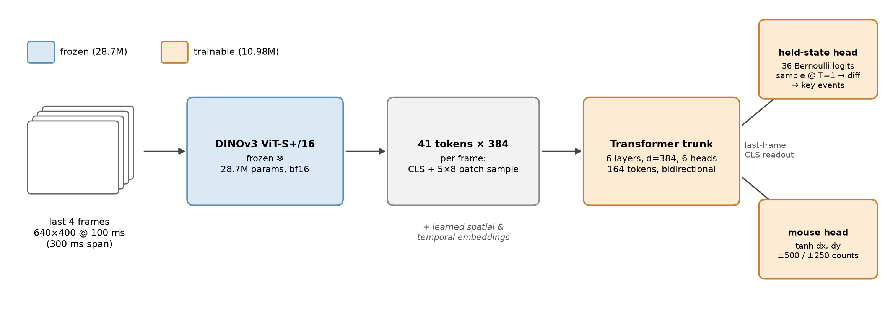
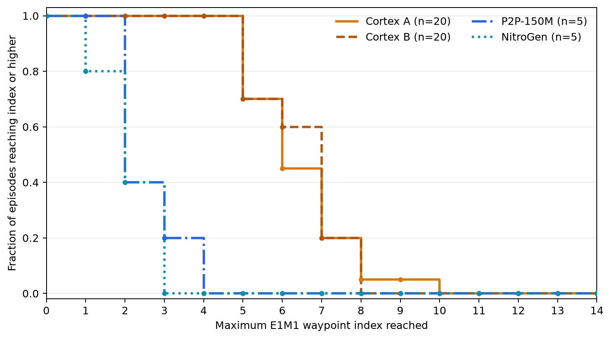
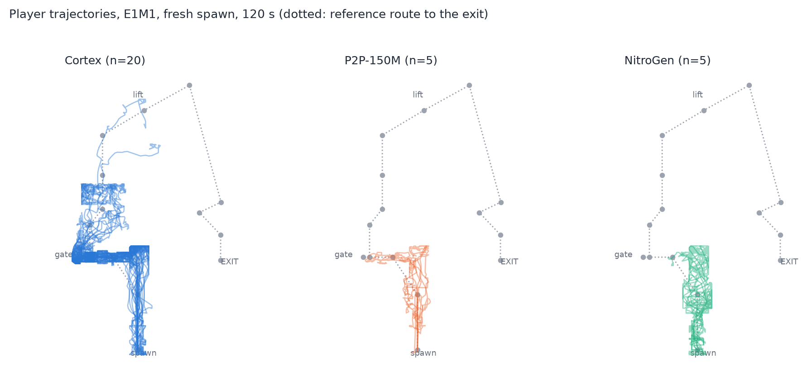
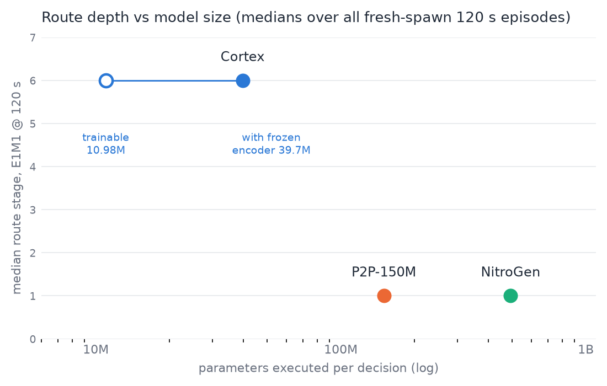
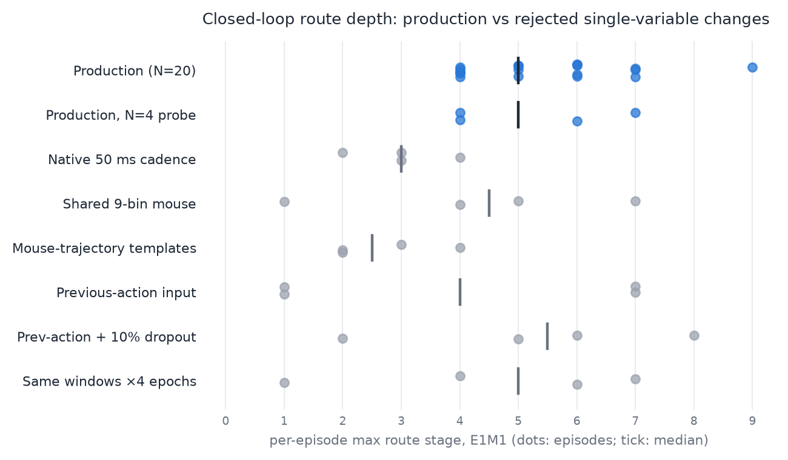

# Cortex: An 11M-Parameter Specialist Policy Outperforms Foundation-Scale Gaming Agents on Quake

**Dzmitry Malyshau**

*2026-07-22 (v2)*

Code: [github.com/kvark/cortex-actor](https://github.com/kvark/cortex-actor) · Weights: [huggingface.co/mad-bot/cortex](https://huggingface.co/mad-bot/cortex) · Video: [youtu.be/Ou9NAmFoCOM](https://youtu.be/Ou9NAmFoCOM)

## Abstract

Recent gaming agents follow the foundation-model recipe: hundreds of millions of parameters, tens of thousands of hours of cross-game video, and a single generalist policy (NVIDIA NitroGen: ~500M parameters, ~40,000 h; Pixels2Play P2P-150M: ~150M parameters, ~8,000 h). We ask how much of that capability a *small specialist* recovers when the vision problem is delegated to a frozen self-supervised encoder. **Cortex** is a policy with 10.98M trainable parameters — a 6-layer transformer over frozen DINOv3 features — trained with pure behavior cloning on 475 hours of publicly released human Quake play, in minutes of optimization on a single consumer GPU (RTX 5080, one epoch, no RL, no game-specific rules). Under a strict engine-verified evaluation protocol on Quake E1M1 (N=20 stochastic episodes across 5 seeds), Cortex reaches the deepest measured route progress of the three systems: 20/20 reliability on the opening door–button–gate sequence, median route waypoint 5–6 (max 9), and 28–32 kills per batch, versus early stalls for the released P2P-150M and NitroGen baselines evaluated in the same environment with their official inference code and published settings. The gap persists under matched episode duration and across additional maps and mid-map start states. We further report controlled ablations showing that offline imitation metrics repeatedly anti-correlate with closed-loop navigation, and that neither higher spatial detail nor longer optimization fixes the dominant failure mode (off-distribution recovery). No system, including ours, completes the level; we propose progress-depth metrics, not completion, as the current discriminator for FPS agents. We release the model code and action schema, the trained checkpoint, and a gameplay video.

## 1. Introduction

Pixel-to-action gaming agents have converged on a scaling recipe: internet-scale gameplay video, action pseudo-labeling where ground truth is missing, and one large generalist policy. NitroGen [1] trains a ~500M-parameter gamepad policy on ~40,000 hours across 1,000+ games; Pixels2Play [2] trains a 150M-parameter keyboard/mouse policy on ~8,000 hours across 40+ titles. Both play many games; neither, as we show, plays any *one* game — at least Quake — particularly deeply.

The recipe carries an implicit claim that is worth testing directly. Historically, small task-specific models were how specific tasks got solved; the emerging position — stated most explicitly by the SIMA line of work [4], which reported that an agent trained across many games outperformed specialized single-game agents even in those games — is that generalist scale now subsumes the specialist even on the specialist's own turf. Our results are a measured counterexample in one domain: on Quake, two released foundation-scale generalists are outplayed, by a wide margin on progress metrics, by a specialist whose gameplay-specific learning is two orders of magnitude smaller and trained on 6–80× less data. We would frame the finding not as "small beats big" but as *generality being better factored than monolithic*: Cortex does lean on a foundation model — a frozen, cross-domain visual encoder whose transfer to Quake is total — while its control policy is specialist. Cross-domain *visual* pretraining transferred completely; cross-game *action* pretraining, in these two released systems, did not transfer to deep competence in this game. Whether this reflects the current generation of gaming generalists or something structural is exactly the question public, engine-verified yardsticks like §5's are for — and our single-game scope, and the partial catch-up of a Quake-fine-tuned P2P (§6.4), bound how far the counterexample generalizes.

This paper takes the opposite bet. We fix a single target game and ask what the minimal policy looks like when: (1) **vision is free** — a frozen, general-purpose self-supervised encoder (DINOv3) supplies all visual representation, so the trainable policy is just a small transformer over cached features; (2) **data is ground truth** — we train on the *same public corpus* P2P released (human Quake play with real recorded keyboard/mouse input), so the comparison against P2P isolates architecture and training discipline from data provenance; (3) **evaluation is adversarial to self-deception** — completion is decided by the game engine's own level-transition event, episodes are stochastic (temperature 1), multi-seed, and inspected visually, and every claim in this paper traces to a retained run manifest.

Contributions:

- **A compact specialist architecture** (§3): 10.98M trainable parameters, 4 frames × 41 DINOv3 tokens, absolute held-state decoding with event-based execution, whose one-epoch optimization takes about 3.5 minutes on one consumer GPU.
- **A matched three-system comparison** (§6): Cortex, P2P-150M, and NitroGen evaluated in the same Quake build, same input pipeline, official baseline inference code, published baseline settings — including matched-duration controls, two additional maps, and two shared mid-map start states.
- **Controlled negative results** (§7): spatial density, native-cadence, distributional mouse heads, previous-action conditioning, and extended optimization all improve offline metrics without improving — often while degrading — closed-loop navigation. We argue offline imitation loss is close to useless as a model-selection signal in this regime.
- **A reproducible progress metric** (§5, Appendix A): staged route waypoints plus engine-verified completion, which we suggest as a common yardstick for FPS agents between "moves at all" and "finishes the level".
- **Released artifacts** (§Reproducibility): the model implementation and action-schema contract ([github.com/kvark/cortex-actor](https://github.com/kvark/cortex-actor), MIT), the trained production checkpoint ([huggingface.co/mad-bot/cortex](https://huggingface.co/mad-bot/cortex)), and a recorded gameplay episode ([youtu.be/Ou9NAmFoCOM](https://youtu.be/Ou9NAmFoCOM)).

## 2. Related work

**Generalist gaming VLAs.** NitroGen [1] couples a SigLIP2-L [10] vision tower with a flow-matching (DiT) action decoder that emits 18-step gamepad chunks; training data is ~40,000 h of internet video with actions pseudo-labeled by an inverse-dynamics model (~15B frames). Pixels2Play [2] is a decoder-only transformer (d=1024, 10 layers, 200-frame context) over one EfficientNet-B0 [11] token per frame, with an autoregressive action head over a 20-key vocabulary and binned mouse deltas; its ~8,000 h corpus is human play with ground-truth input capture. Minecraft agents (VPT [8], STEVE-1 [9], and the goal-conditioned Pan family [3]) established the video-pretrain and hindsight-goal toolbox; we borrow their emphasis on closed-loop evaluation over proxy metrics.

**FPS agents.** First-person shooters have a dedicated research lineage. ViZDoom [15] established Doom as a platform for visual RL; population-based reinforcement learning reached human-level capture-the-flag play in Quake III Arena [16] from game-state rewards and massively parallel experience rather than demonstrations; and large-scale behavior cloning from scraped gameplay video produced competent aim-and-fire behavior in Counter-Strike deathmatch [14] — the closest precursor to our setting, though it evaluates combat in a single arena rather than route progress through single-player levels. Our addition to this line is a matched, engine-verified comparison of released foundation-scale generalists against a specialist in the same environment.

**Frozen-feature control.** Our design follows the growing evidence that frozen pretrained vision features transfer to control without fine-tuning: frozen encoders are competitive with ground-truth state for policy learning [19], and R3M [20] and VC-1 [21] made frozen representations a standard tool in robot learning; the DINO family [5, 6, 7] supplies the strongest self-supervised instances. We push this to the extreme: the policy never sees a pixel; it is trained and deployed entirely on cached or streamed DINOv3 activations.

**Imitation learning and its failure modes.** Behavior cloning's compounding-error pathology is classical — identified with ALVINN [13] and formalized, with its interactive-correction remedy, by DAgger [12]; our central negative finding (off-distribution recovery as the binding constraint, §7.7) is its modern instance at FPS timescales. Our observation that offline imitation metrics fail to select good policies replicates, in a new domain, the robomimic finding that validation loss is a poor predictor of closed-loop success in manipulation [22]. The commitment mechanism our mouse-head experiments converge toward (§7.3) is action chunking, established independently in robotics by ACT [17] and Diffusion Policy [18], and built into NitroGen's chunked decoder architecturally.

## 3. Architecture

Cortex is deliberately minimal. Per 100 ms decision:

- **Vision.** Each 640×400 frame is encoded by frozen DINOv3 ViT-S+/16 [5] (bf16) into a 25×40 patch grid plus a CLS token. We keep CLS and an ordered 5×8 uniform spatial sample of the patch grid: 41 tokens × 384-d per frame. Nothing about this stage is Quake-specific.
- **Trunk.** The last 4 frames (300 ms span) → 164 tokens, plus learned per-token spatial and per-frame temporal embeddings, through a 6-layer, 384-d, 6-head, feed-forward-1536 bidirectional transformer encoder. The output at the last frame's CLS position is the policy summary.
- **Heads.** (a) a linear *held-state* head: 36 independent Bernoulli logits — 33 keyboard keys plus 3 mouse buttons — trained with BCE against the demonstrator's *absolute* held state; (b) two linear mouse heads emitting tanh-squashed continuous dx/dy, trained with smooth-L1 and scaled to (±500, ±250) counts at deploy.
- **Decoding.** At deploy the held state is *sampled* per channel at temperature 1 (we show in §7 that deterministic thresholding is a materially different — worse — policy), masked to the game's legal channels (Quake: `w a s d space` plus fire), and converted to press/release events by diffing against the previously executed state. There is no previous-action input, no memory beyond 300 ms, no pose, no map, no text, no auxiliary loss, and no game-specific behavior rule.

*Figure 1: the Cortex architecture. Blue components are frozen and shared across every model in the project; orange components are the 10.98M trainable parameters. Full optimizer and loss settings are in Appendix B.*

**Parameter accounting — an important nuance.** The 10.98M figure counts *trainable* parameters only. The frozen DINOv3 ViT-S+/16 encoder adds 28.7M parameters at inference, so the complete Cortex system executes about 39.7M parameters per decision — still 3.8× smaller than P2P-150M and 12× smaller than NitroGen, but not 14×/45×. We report the trainable number as the headline deliberately, and the comparison is fair under a specific reading: the baselines' parameter budgets are *entirely gameplay-trained* (P2P trains its vision stem end-to-end; NitroGen tunes its SigLIP2 tower on gameplay), so adapting them to new data means retraining vision, whereas Cortex's vision is a general-purpose, publicly available encoder that we never train, never store per-checkpoint, encode once per corpus, and share across every model, probe, and auxiliary task in the project. The claim being tested is precisely that gameplay-specific learning can be this small when general visual representation is factored out. Readers who prefer total-executed-parameter comparisons should use 39.7M.

The checkpoint stores the full train/deploy contract (cadence, action alignment, patch grid, action schema); deployment refuses a mismatched configuration.

| Component | Value |
|---|---|
| Vision encoder | DINOv3 ViT-S+/16, frozen, 28.7M params, 640×400 |
| Tokens per frame | 1 CLS + 40 patches (5×8 of 25×40), 384-d |
| Context | 4 frames / 300 ms |
| Trunk | 6 layers, d=384, 6 heads, FF 1536, bidirectional |
| Action heads | 36-ch held-state BCE; 2× continuous mouse |
| Decision rate | 10 Hz (100 ms simulated-time interval) |
| Trainable / total inference params | 10.98M / 39.7M |
| Training | 1 epoch (32,320 steps), 517k windows, batch 16, ~2,600 samples/s, ~3.5 min on a single RTX 5080 |

## 4. Data

We train on the Quake subset of the publicly released Pixels2Play corpus (`elefantai/p2p-full-data`): **6,850 recordings, ~475 hours, 17.09M frames at 20 fps**, with ground-truth human keyboard/mouse capture. Ground truth is a deliberate choice, not a convenience — our earlier attempt to build a Quake corpus with generalist-IDM pseudo-labels failed on label quality (§7.5). Frames are encoded once by the frozen vision stack; training streams cached features.

- **Alignment.** Observation *i* is trained against the action interval beginning at *i+1* (matching the corpus's released loader semantics); the sampling stride (20 fps → 10 Hz) and offset are recorded in every data artifact and checkpoint.
- **Sampling.** 129,262 training chunks; 4 deterministic, distinct 4-frame windows per chunk = 517,048 windows per epoch (3.27% of the 15.83M valid windows; a controlled follow-up with 4× more distinct windows left closed-loop play unchanged — §9).
- **Validation** is held out **by recording**, never by adjacent frames.
- No augmentation, no reweighting, no filtering beyond validity.

## 5. Evaluation protocol

All systems play the same build of Quake through the same virtual input device and the same frame-capture pipeline, with per-episode run manifests pinning checkpoint hashes and full command lines. The engine is vkQuake, a modern source port of the original game, which we extend with a read-only telemetry channel: each simulation tick, the engine exports the player's pose, health, kill count, and the level-to-intermission transition event. These modifications *observe* game state — they alter no game logic, physics, content, or difficulty, inject nothing, and are identical for every system (the shared mid-map start states of §6.3 use the engine's stock save/load). The engine simulates at a fixed 60 Hz tick, which sets the granularity of both simulation and action injection; each policy's decision cadence is an integer number of ticks (Cortex every 6 ticks = 100 ms, P2P every 3 ticks = 50 ms, NitroGen one chunk action per tick).

**Time-controlled execution.** The environment gates simulation on decisions: the engine advances only after the policy's action for the current observation has been injected, so episodes are measured in *simulated game time* and every system meets its native cadence exactly, regardless of how long its forward pass takes. This is a deliberate feature of the evaluation environment, and it departs from how the baselines were originally demonstrated by their authors, which was wall-clock real time on dedicated hardware: P2P documents a two-GPU workstation (an RTX 5090 reserved for model inference plus an RTX 5080 for game rendering) and an end-to-end latency budget under 50 ms; NitroGen's release does not document an evaluation hardware setup. Time control is what makes the comparison well-defined without that hardware: no system ever acts on a stale frame or skips a decision, so inference latency is removed as a confound entirely, and the baselines are, if anything, favored relative to their wall-clock behavior — they receive their exact published cadence for free. It also lowers the replication bar substantially: every number in this paper, including Cortex's training, was produced on a *single* RTX 5080 shared between the game and whichever policy is playing, with no latency engineering required to reproduce it. All reported durations (60 s, 120 s) are game-time seconds under this regime, identically for all three systems.

**Baseline harness.** Both baselines run their *official released inference code end to end* — we wrap it in the environment's observation/injection loop but do not reimplement any model-side processing or decoding:

- **P2P-150M**: the released 150M checkpoint (training step 500k, hash-pinned), driven through the upstream KV-cache inference state, which owns preprocessing and decoding: 192×192 Hamming resize per the upstream pipeline, autoregressive action decoding with the checkpoint's native sampling temperature (1.0), truncated-normal mouse-bin dequantization, 20 Hz. Mouse sensitivity 3.5 per the upstream tested-games table. The 200-frame context is never externally reset (the context-reset variant appears only in §6.4 as *our* modification, labeled as such).
- **NitroGen**: the official released checkpoint and processor (hash-pinned HF snapshot), frames resized to 256×256 per its image processor, bf16, and the checkpoint's native 18-action gamepad chunks executed at 60 Hz. NitroGen emits gamepad actions; we map them to Quake's keyboard/mouse controls with a fixed, published mapping (left stick → WASD, right stick → mouse look, south button → fire; the full table is Appendix D). One known residual handicap is documented: the mapping binds no jump control, because no released NitroGen button semantics correspond cleanly to Quake's jump; E1M1's critical path is completable without jumping.

Cortex runs under the identical environment, capture, and injection path at its own native cadence.

- **Completion is engine-verified**: an episode counts as a success only if the engine reports the level→intermission transition. No visual or distance-based proxy is accepted.
- **Route waypoints** (E1M1): 14 ordered stages (first door, button room, gate descent, dark room, bridge foot, later halls, …) scored from the engine's player pose; we report the per-episode maximum stage. The full waypoint table, coordinates, and scoring rule are in Appendix A.
- **Batches**: N=20 episodes (4 parallel lanes × 5 policy seeds), 120 s of simulated play each, stochastic decoding, no episode selection. Every lane retains a full video, action trace, pose trace, and a 12-frame contact sheet; all 20 sheets are visually inspected per batch.
- **Statistics**: success rates carry Wilson 95% intervals (headline intervals in §6.1; every per-batch aggregate retains them); the headline batch was independently replicated (fresh seeds) before publication.

## 6. Results

### 6.1 Main comparison (Quake E1M1)

*Figure 2: episodes reaching route stage ≥ k on E1M1 (fresh spawn, 120 s, temperature-1 decoding). Both Cortex batches (n=20 each) pass the opening door–button–gate sequence 20/20 and fall off between the dark room and the y=1800 doors; the matched-duration released baselines (n=5 each) have median stage 1. Stage indices follow the route ladder of Appendix A.*

| | Cortex (N=20×120 s) | Cortex replication (N=20×120 s) | P2P-150M (N=5×120 s) | NitroGen (N=5×120 s) |
|---|---|---|---|---|
| Trainable params | 10.98M (39.7M with frozen encoder) | — | ~150M | ~493M |
| Training data | 475 h (1 game) | — | ~8,000 h (40+ games) | ~40,000 h (1,000+ games) |
| E1M1 completion | 0/20 | 0/20 | 0/5 | 0/5 |
| Opening sequence (door/button/gate) | **20/20 each** | **20/20 each** | 0/5 (button room 1/5) | 0/5 |
| Route waypoint median (max) | 5 (9) | **6 (7)** | 1 (3) | 1 (2) |
| Episodes with ≥1 kill | 19/20 | 19/20 | 2/5 | 0/5 |
| Total kills | 32 | 28 | 2 | 0 |
| Deaths | 15/20 | 18/20 | 0/5 | 2/5 |

The baseline columns are the matched-duration 120 s batches (per-episode detail below); Cortex's 40 per-episode rows are in Appendix C. With Wilson 95% intervals: completion is 0/20 → [0%, 16.1%] in each Cortex batch, and the opening sequence at 20/20 → [83.9%, 100%] in each batch, independently.

A representative Cortex episode (fresh spawn, temperature-1 decoding) is available at [youtu.be/Ou9NAmFoCOM](https://youtu.be/Ou9NAmFoCOM). In the earlier 60 s screens under the same protocol, the released P2P-150M averages 2,485 path units with 38% stagnation and 2 kills; NitroGen's best episode reaches a straight-line displacement of 1,145 units with zero kills. Cortex's median straight-line displacement at 120 s is 1,481 (max 2,526) with median path length 10,520 — while also fighting (≥1 kill in 19/20 episodes) and pressing the route-critical button in every episode.

*Figure 3: top-down player trajectories on E1M1 (fresh spawn, 120 s; dotted line is the reference route to the exit; polylines are broken at respawn teleports). Cortex's episodes traverse the gate and continue past the bridge toward the lift; both baselines' episodes remain in the spawn corridor and first rooms. This is the geometric content of Figure 2.*

*Figure 4: median route stage at matched 120 s versus parameters executed per decision (log scale). The Cortex median (6.0) pools all 40 fresh-spawn episodes across the production and replication batches; baseline medians (1.0) are from their matched-duration batches. The open marker is Cortex's trainable size; the filled marker includes the frozen encoder (§3's accounting nuance).*

**Matched-duration control.** The baselines were first screened at 60 s; to rule out that budget as their limiter, we re-ran both released baselines at 120 s × 5 episodes (identical settings otherwise) — these are the batches in the table above. P2P-150M: 0/5 completions, route waypoint median **1** (max 3), max straight-line displacement 914–1,064, 2 kills, stationary stretches up to 34 s. NitroGen: 0/5, route waypoint median **1** (max 2), displacement ceiling 1,047, 0 kills, 2 deaths. Doubling the time added wandering, not route progress — the stall is behavioral, not budgetary. At equal 120 s duration the route-depth comparison is direct: baseline median waypoint 1 versus Cortex median 5–6 (max 9).

Per-episode rollout metrics for the matched-duration baseline batches (all quantities from the engine's pose/state stream; stationary = longest interval with no position change):

| System, episode | Route stage | Max displacement | Path length | Longest stationary | Kills | Outcome |
|---|---|---|---|---|---|---|
| P2P ep0 | 1 | 914 | 2,190 | 11.4 s | 0 | time limit |
| P2P ep1 | 1 | 1,045 | 5,127 | 21.9 s | 0 | time limit |
| P2P ep2 | 3 | 1,063 | 5,172 | 14.9 s | 1 | time limit |
| P2P ep3 | 1 | 919 | 4,673 | 6.8 s | 0 | time limit |
| P2P ep4 | 2 | 1,045 | 4,986 | 34.5 s | 1 | time limit |
| NitroGen ep0 | 2 | 1,044 | 4,232 | 4.3 s | 0 | died @ 59 s |
| NitroGen ep1 | 1 | 1,043 | 9,170 | 4.6 s | 0 | time limit |
| NitroGen ep2 | 2 | 1,047 | 10,983 | 5.6 s | 0 | died @ 89 s |
| NitroGen ep3 | 0 | 299 | 4,216 | 19.3 s | 0 | time limit |
| NitroGen ep4 | 1 | 759 | 11,416 | 3.9 s | 0 | time limit |

The two failure styles differ: P2P episodes include long fully-stationary stretches (up to 34.5 s); NitroGen moves continuously (path lengths up to 11,416 with stationary stretches under 6 s) but recirculates the same early rooms — its displacement ceiling (~1,045) is the geometric radius of the pre-gate area, the same wall visible in Figure 3. Both baselines' per-episode route stages appear as the orange and aqua curves of Figure 2.

### 6.2 Robustness: additional maps

To show the E1M1 result is not map-specific tuning (there is none — no agent contains map logic), we ran all three systems on E1M2 and E1M3 (120 s × 5 episodes, same protocol; the waypoint ladder is E1M1-only, so we report displacement, kills, and survival). These maps have substantially harsher openings than E1M1; every system dies frequently.

| Map | System | Chord median (best) | Kills | Died | Median survival |
|---|---|---|---|---|---|
| E1M2 | Cortex | **791 (2,008)** | **6** | 5/5 | 25 s |
| E1M2 | P2P-150M | 704 (791) | 4 | 3/5 | 37 s |
| E1M2 | NitroGen | 679 (797) | 1 | 5/5 | 26 s |
| E1M3 | Cortex | **706 (1,126)** | 12 | 5/5 | 14 s |
| E1M3 | P2P-150M | 658 (706) | **15** | 3/5 | 46 s |
| E1M3 | NitroGen | 390 (529) | 0 | 4/5 | 56 s |

Cortex leads displacement on both maps and combat on E1M2; P2P records more kills and longer survival on E1M3, where Cortex dies fast by engaging the enemy-dense opening head-on. NitroGen never kills anything and survives longest on E1M3 by wandering shallowly. No system completes any map. The honest summary: the specialist's advantage generalizes across maps on progress metrics, is not uniform on combat metrics, and survival under pressure is every system's weakness — consistent with the recovery-data diagnosis of §7.7.

### 6.3 Robustness: shared mid-map start states

Single-player Quake has one fixed spawn per map, so we constructed spawn variation from shared engine save states: two E1M1 mid-map snapshots (state A at 30 s and state B at 60 s into a reference trajectory, the latter past the gate descent) loaded identically for every system at episode start (120 s × 5 episodes; Cortex/A retains n=4 after a harness incident unrelated to any policy). Waypoints count route gates the episode touches: state A sits between gates (reads 0 until the agent moves), state B starts at gate 5. Both states carry mid-fight health/ammo, so survival pressure is high for everyone.

| Start | System | Waypoints reached | Chord median (best) | Kills (incl. save's 1) | Died | Median survival |
|---|---|---|---|---|---|---|
| A (30 s) | Cortex | [5,5,6,6] | **919 (950)** | 5/4 eps | 3/4 | 47 s |
| A (30 s) | P2P-150M | [0,4,5,6,7] | 484 (**1,375**) | 9/5 eps | 2/5 | **120 s** |
| A (30 s) | NitroGen | [5,5,5,6,6] | 661 (731) | 7/5 eps | 5/5 | 25 s |
| B (60 s) | Cortex | [5,5,6,6,**7**] | 628 (716) | 7/5 eps | 5/5 | 32 s |
| B (60 s) | P2P-150M | **[6,6,7,7,7]** | 652 (966) | **10**/5 eps | 3/5 | 26 s |
| B (60 s) | NitroGen | [5,5,5,5,6] | 230 (406) | 6/5 eps | 5/5 | 11 s |

Every system copes with mid-map starts to some degree — including the baselines, whose fresh-spawn stalls (§6.1) therefore reflect failure to *get* deep rather than inability to act deep. Cortex posts the largest displacement from state A and the deepest single gate (7) from state B; P2P is the most consistent from state B and the most survivable overall; NitroGen advances least beyond its handed position and dies fastest. As on the extra maps, the specialist's advantage is clearest on progress metrics and nobody is safe in a fight it starts in the middle of.

### 6.4 Fine-tuning the baseline

To separate corpus from architecture, we also fine-tuned P2P-150M on the same Quake corpus with the same alignment discipline (training setup in Appendix E). The faithful fine-tune raises its mean path from 2,485 to 3,599 (stagnation 38%→19.5%); adding sparse history-corruption training and periodic 200-action context resets raises it to 5,422 and route waypoint 7. The strongest P2P variant therefore approaches — but does not match — the specialist's route reliability, and only when its 10 s context window is periodically cleared, suggesting long contexts self-poison off-distribution. This bounds the scaling premise from below as well: the remaining gap did not close with more gradient steps on in-domain data, but with an inference-time intervention — and on our own recipe, additional optimization at fixed data was flat-to-negative closed-loop (§7).

## 7. What did *not* work (controlled)

Each row is a single-variable change on the production recipe, evaluated closed-loop; several improved offline metrics while degrading play. The subsections that follow expand the design-space history behind these rows — the encodings, inputs, and objectives we tried and rejected on the way to the final recipe, with the measurements that killed each one.

| Change | Offline effect | Closed-loop effect |
|---|---|---|
| 5×8 → 10×16 patch grid | imitation ↑ | route median 5→4, gate 20/20→14/20 |
| 5×8 → full 25×40 grid | imitation ↑, kills ↑ | mean/max route ↓, gate reliability ↓, 30× slower training |
| 100 ms → native 50 ms cadence | pack/audit pass | best route [4,3,3,2] vs [6,4,4,7] |
| Shared 9-bin mouse distribution | magnitude ↑ | vertical random walks; rejected |
| 10-step mouse-trajectory templates | code occupancy matches | NLL = marginal entropy (prior-fitting); route halves |
| Previous-action input (4 variants) | held-F1 ↑ | bimodal self-lock or worse recovery |
| Same windows × 4 epochs | held F1 0.588→0.600 | route collapses by final ckpt, pitch p90 78° |
| Deterministic (T=0) decoding | — | materially different, worse policy |

*Figure 5: per-episode max route stage for the production recipe versus rejected single-variable changes (dots: episodes; tick: median; N=4 screening batches except where noted). Route depth was the primary but not sole rejection criterion: the two variants whose route medians match production (previous-action + 10% dropout; ×4 epochs) were rejected on kill incidence, late-checkpoint collapse, and camera stability at larger N — see the rows above and §7.2.*

### 7.1 Event-based action encodings

The production absolute held-state head is the third keyboard encoding this project shipped, and the first two are instructive. The natural first choice is an *event* encoding — per key, a ternary {keep, press, release} class per frame, mirroring how the input device is actually driven. It fails distributionally: almost every frame's label for almost every key is "keep", so supervision concentrates on a >99% majority class, and at deploy per-frame decoding flickers between event classes, producing motor jitter and stuck keys.

The second attempt kept event semantics but made the event generator part of the model: per-key leaky integrate-and-fire accumulators (separate press and release streams, learned per-key decay and threshold) turning a continuous "intent strength" into discrete events, with identical dynamics at train and deploy. This genuinely worked — it matched our strongest RL-trained checkpoints of that period with behavior cloning alone — but its deployment behavior was hostage to a single firing-threshold scalar: at 0.5 every movement key fired about half the time (motor jitter and fire-button spam), at 0.7 the fire button was fully suppressed, at 0.8 the agent froze. The sweet spot existed but was found by sweep, per checkpoint.

Predicting the demonstrator's **absolute held state** per frame — 36 independent Bernoulli channels, BCE loss, temperature-1 sampling, diffed against the previously executed state to derive events — replaced both, beating the integrator head by 14–18% on closed-loop progress at the time it was adopted. The reasons it wins are structural: the output matches what the game consumes (a state, not an event stream); each frame re-anchors the full state so a momentary mistake does not accumulate; every channel of every frame carries supervision (no sparse-event class imbalance); and visual conditioning keeps the joint state plausible across keys. Its one representational weakness is sub-frame taps — a 100 ms decision cannot express a 30 ms jump tap — which we addressed on the data side: sub-frame key events are OR-aggregated (and mouse deltas summed) into each frame's label window, recovering roughly half of all jump events that a naive point-sampled alignment silently dropped.

### 7.2 Action history as an input

Twice we fed the policy its own recent actions, and twice the model turned into a self-imitator. An early recipe passed a 74-dimensional action context (held state, hold durations, and an EMA of recent mouse motion) into the trunk; a causal intervention on the trained model (same frame, vary only the EMA input) measured the policy's mouse output following the EMA input with slope ≈ 0.7, with vision reduced to a small modulator. Closed-loop, any small initial bias compounds through the feedback path to a fixed point — the agent spins in place. Separately, a minimal variant fed only binary held-state history and predicted next-frame held state; because keys are sticky, copying the last frame is near-perfect, and the diagnostic was unambiguous: *zeroing the visual input improved* its offline accuracy while zeroing the action history collapsed forward-key recall to 0.00. The model had learned the identity function and kept vision as dead weight.

Intermediate mitigations — zeroing the context at deploy (hides the shortcut without removing the trained reliance), randomly dropping the context during training (helps, at a cost) — were each tried before the production answer: no action inputs at all. Four later attempts to reintroduce previous-action conditioning under the production recipe, varying encoding and dropout, reproduced the pathology as bimodal self-lock or degraded off-distribution recovery (§7 table). It is notable that both released baselines avoid this trap *by construction* — P2P's context carries frame embeddings, not actions, and NitroGen's chunked decoding leaves no recent-action signal to copy — which we read as convergent evidence rather than coincidence.

### 7.3 Mouse output parameterizations

The mouse head consumed more failed experiments than any other component. The production head is plain smooth-L1 regression to a tanh-squashed delta, and we can state precisely what is wrong with it: on a symmetric, multimodal delta distribution, regression collapses toward the conditional median — on large human turns the trained head recovers only a small fraction of the magnitude, and its sign agreement with the demonstrator is near chance. It is, by offline measures, a poor imitator of human mouse behavior.

Every distributional replacement we built was nevertheless *worse in play*. Classification over 5 bins, over 9 power-spaced bins, and over a shared discretized distribution all restored sampled magnitude (e.g. sampled |dx| ≈ 0.27 against a target 0.31) while leaving large-turn *direction* at chance (0.56–0.59 sign agreement) — the sampled turns are decisive but directionless, which converts to vertical random walks and yaw noise, breaks forward pacing, and in our hardest checkpoint-matched comparison produced zero route descents where the regression head produced them stochastically. Ten-step trajectory *templates* (a small codebook over 1 s mouse futures, cross-entropy to the nearest template of the true future) fit the marginal prior — their NLL converged to the marginal entropy — and halved route progress. On an earlier model line we did find one mechanism that repeatably restored turn commitment: keep the codebook but move commitment into the *deploy sampler* (sample a template, then hold it over a receding horizon rather than re-deciding every frame). That result localizes the failure: what all per-frame heads lack is not expressiveness but *commitment* — the property robotic imitation learning obtains through action chunking [17, 18], and which NitroGen's 18-step chunks provide architecturally — and what no head fixes is *initiation*: knowing which way to turn given the scene, which is a representation/objective problem, not an output-parameterization one.

### 7.4 Auxiliary supervision on the trunk

Given §7.3's diagnosis, the obvious move is to supervise direction directly. Probes on the frozen visual features say the signal is there: a small MLP on frozen CLS features predicts *when* a large turn is about to happen well above chance (turn-occurrence balanced accuracy 0.61 vs 0.52 baseline, ≈8σ on ~2,000 held-out shards) and turn *direction* weakly but reliably (0.573 vs 0.526). Yet three attempts to distill that signal into the policy trunk as auxiliary losses — per-frame yaw-delta regression at two loss weights, future-cumulative-yaw regression, and future-yaw 3-class classification — all plateaued at or below chance on the same held-out probe distribution, *below what the frozen-feature probe extracts from the trunk's own inputs*. The classification variant actively degraded with training as it learned the class prior and stopped predicting rare events. Our reading: the BC objective competes with, and wins against, auxiliary signals for trunk capacity; joint aux heads on a BC trunk are a dead lane in this regime, and future work should change the policy's inputs or objective instead.

### 7.5 Pseudo-labeled data from a generalist inverse-dynamics model

Before adopting the ground-truth-labeled corpus, we tried the generalist recipe's data path ourselves: collect Quake gameplay video and pseudo-label the actions with a released ~1B-parameter generalist inverse-dynamics model — the same class of labeler behind NitroGen's ~40,000-hour corpus. The label quality, measured after the fact, was disqualifying. Across the labeled recordings, **43% contained no keyboard predictions at all** and another 16% were sparse (fewer than 30 key events per recording); only 37% carried rich keyboard labels. Spot-checking the failures against the source videos showed footage with obvious continuous movement and firing labeled with *zero* key events. The aggregate distortion was severe: in the resulting training cache, the forward key — the single most-held key in real FPS play — became the *rarest* labeled event (0.69 presses per 1,000 events, roughly 40× sparser than ground-truth input capture of comparable play). A policy cloned from these labels faithfully learned the corruption: it treated pressing forward as an exceptional event and idled in place at deploy. As a secondary economics note, pseudo-labeling is not cheap to escape from either — on our single consumer GPU the labeler ran ~50–100× slower per clip than the multi-GPU serving cluster used to produce such corpora at scale, so re-labeling our way out of the quality problem was not an option.

We do not claim NitroGen's corpus has this failure rate — its labeler, filtering, and games differ, and we measured only our own attempt. But the episode is a concrete, checkable instance of the recipe's known structural cost: IDM pseudo-labels fail *silently*, the failures are systematically biased (here, against sustained key holds), and behavior cloning transmits the bias directly into the policy. Ground-truth input capture — the Pixels2Play corpus's defining property, and the reason we train on it — removes this entire failure class.

### 7.6 Cross-game data

On a pre-DINOv3 iteration of this project we trained the same Quake policy with and without an additional multi-game FPS corpus (27 titles, each with its own key-binding conventions) mixed into training. Removing the cross-game data *improved* Quake offline action accuracy by 29% and loss by 18% on the identically selected checkpoint — the multi-game mixture had biased the shared action head toward other games' control conventions. This is a small, dated data point, but it is a direct measurement of a tax the generalist recipe pays by default, and it is why every subsequent iteration trained on Quake alone.

### 7.7 General lessons

Two general lessons. First, **offline imitation metrics anti-correlate with closed-loop ability** often enough that they cannot select checkpoints; only live batches can. This recurred independently in the spatial-density ablations (§7 table), the mouse-head line (offline checkpoint ranking inverted the closed-loop ranking), and the epoch-scaling probe — and it matches the robomimic finding in manipulation [22]. Second, the binding constraint is **off-distribution recovery** — the policy is competent on human-like states and unreliable on its own wall/corner/water states — the covariate-shift regime identified by the classical imitation literature [13, 12]. What our ablations add is that within-distribution improvements — spatial detail, longer optimization — do not buy recovery.

## 8. Limitations

No system completes E1M1 under the engine-verified observer, ours included; Cortex's failures have moved from the opening (now 20/20) to mid-route recovery, memory, and intent, and its context is 300 ms. The comparison is specialist-vs-generalist by construction: we make no claim about cross-game transfer, only about what a target game actually requires. The parameter comparison carries the nuance of §3: our headline number excludes a frozen general-purpose encoder that the baselines effectively bundle as gameplay-trained weights. All systems were evaluated on one game, on three maps of that game; batch-to-batch route medians swing by about one stage between seed batches (5 vs 6 across our two N=20 batches), which is why we replicate and pool rather than quote single batches.

## 9. Future work

Each direction below is anchored in a measurement; several come from controlled follow-up experiments run after the first version of this paper, as single-variable changes on the production recipe under §5's staged evaluation.

**Corrective data for off-distribution recovery.** §7.7's diagnosis calls for DAgger-style correction [12], but interactive expert time is the expensive resource. A data-side approximation that needs no new demonstrations — reweighting training toward corpus windows whose *starting* frame is similar, in frozen-CLS space, to the policy's own measured failure states, so that training oversamples the demonstrator's committed recovery behavior — reduced deaths at matched exposure (pooled over two independent N=20 batches: 33/40 → 25/40 episodes ending in death) while giving back some opening-route discipline. Survivability is movable by data selection alone; interactive corrective demonstrations remain the clean instance of the recipe.

**RL and self-imitation from the frozen BC checkpoint.** Both longer optimization (§7) and, in follow-up experiments, 4× more distinct training windows leave closed-loop performance unchanged — the pure-BC recipe appears saturated at this scale and data. That is the classical justification for interactive fine-tuning: RL or self-imitation initialized from the frozen checkpoint, gated on engine-verified progress rather than any offline proxy (§7.7).

**Goal conditioning requires off-momentum supervision.** The natural mechanism for intent — conditioning the policy on a future goal frame with hindsight-sampled goals, following Pan-1 [3] — fails at our scale in an instructive way. Trained with a goal-frame CLS token (goal dropout 0.25, horizons 2–30 s and a 0.5–5 s curriculum), the policy learns to *ignore the goal entirely*: paired goal-provided versus goal-dropped validation deltas are null over 6,000 windows, including on the big-turn subset where goal information should concentrate. Probes attribute the failure to the data rather than the optimizer: goals drawn from the demonstrator's own future are confounded with momentum — the current frames already predict the goal's direction (the goal frame's CLS alone predicts imminent turn direction at chance, and a goal-in-view localization feature adds only +0.004 accuracy over the current view). Hindsight relabeling therefore never supervises the case that matters at deploy: steering the policy somewhere it was *not* already going. The surviving forms are goal-conditioned RL with HER-style relabeling, which manufactures off-momentum pairs, and cross-trajectory goals matched by place rather than by trajectory.

**Memory, only with an objective that consumes it.** Passively extending the visual context from 300 ms to 700 ms improves offline imitation by the familiar non-transferring increment (held F1 0.588 → 0.597) and does not improve play — §7's offline/closed-loop dissociation again. Visited-place memory and longer context should enter together with objectives that read them — recognizing accumulated non-progress, goal seeking — not as passive inputs.

**Coherent joint action decoding.** Per-channel independent sampling can emit opposing chords (simultaneous strafe-left and strafe-right) that a demonstrator never holds; a joint or persistent decoder that preserves the learned per-channel marginals is untested.

**Breadth and shared yardsticks.** The out-of-distribution level packages of Quake's expansions (new geometry unseen by any training corpus) are the natural next robustness tier, followed by other games as sibling specialists sharing the same frozen encoder. The standing question of §1 — whether foundation-scale *action* pretraining can be made to transfer as completely as visual pretraining does — is best settled on common, engine-verified benchmarks; we offer §5's protocol and Appendix A's ladder as a starting point.

## Reproducibility

Everything needed to load and run the policy is public. The model implementation and the action-schema contract (the ordered key roster whose indices define the checkpoint's channel layout) are released at [github.com/kvark/cortex-actor](https://github.com/kvark/cortex-actor) under MIT. The trained production checkpoint — weights, architecture arguments, and the embedded action schema, exactly the artifact evaluated in §6 — is at [huggingface.co/mad-bot/cortex](https://huggingface.co/mad-bot/cortex) (43.9 MB fp32; the frozen DINOv3 encoder is obtained separately from Meta under its own license). A recorded episode of this checkpoint playing E1M1 is at [youtu.be/Ou9NAmFoCOM](https://youtu.be/Ou9NAmFoCOM).

The training corpus is public (`elefantai/p2p-full-data`, used under the terms it was released with on Hugging Face). Training is one epoch on one consumer GPU: about 3.5 minutes of policy optimization at ~2,600 samples/s (full settings in Appendix B), after a one-time frozen-encoder pass over the corpus (at the measured 207 frames/s, roughly 23 GPU-hours for all 17.09M frames; in practice dominated by storage I/O). The evaluation engine is the GPL vkQuake source port with the game's own content; the shareware first episode contains all maps used here. Baselines use official released checkpoints and inference code. Evaluation batches, manifests, per-episode traces, and contact sheets are retained for every number in this paper.

## Broader impact

This work studies agents in a 1996 single-player video game and releases a small game-specific policy; we see no direct societal risk beyond those of the released baselines it compares. The transferable content is methodological: engine-verified evaluation, matched-baseline discipline, and the documented unreliability of offline imitation metrics for closed-loop model selection.

## Acknowledgements

We thank Elefant AI for publicly releasing the Pixels2Play corpus, inference code, and checkpoint — the data this work trains on, and the openness that makes matched comparisons possible — and NVIDIA for the open NitroGen release. We thank the vkQuake maintainers and id Software for the GPL Quake engine, and Meta AI for DINOv3.

## AI assistance disclosure

The development of this work was heavily AI-assisted. The model implementation, training and evaluation tooling, the experiments themselves, and the text of this paper were produced in collaboration with Anthropic's Claude and OpenAI's Codex, working under the direction of the author, who set the goals, reviewed the results, and takes responsibility for all claims. The scale of that contribution goes well beyond conventional tool use, and this section, rather than the author list, is where it is credited. All quantitative results trace to retained run manifests as described in the Reproducibility section, independently of who — human or model — produced the code that generated them.

## References

[1] NVIDIA. *NitroGen: An Open Foundation Model for Generalist Gaming Agents.* arXiv:2601.02427.

[2] Elefant AI. *Scaling Behavior Cloning Improves Causal Reasoning* (Pixels2Play). arXiv:2601.04575.

[3] Pantograph. *Pan-1.* pantograph.com/journal/pan-1.

[4] DeepMind SIMA team. *Scaling Instructable Agents Across Many Simulated Worlds.* arXiv:2404.10179.

[5] Siméoni et al. *DINOv3.* arXiv:2508.10104.

[6] Oquab et al. *DINOv2: Learning Robust Visual Features without Supervision.* arXiv:2304.07193.

[7] Caron et al. *Emerging Properties in Self-Supervised Vision Transformers.* arXiv:2104.14294.

[8] Baker et al. *Video PreTraining (VPT): Learning to Act by Watching Unlabeled Online Videos.* arXiv:2206.11795.

[9] Lifshitz et al. *STEVE-1: A Generative Model for Text-to-Behavior in Minecraft.* arXiv:2306.00937.

[10] Tschannen et al. *SigLIP 2: Multilingual Vision-Language Encoders.* arXiv:2502.14786.

[11] Tan and Le. *EfficientNet: Rethinking Model Scaling for Convolutional Neural Networks.* arXiv:1905.11946.

[12] Ross, Gordon, and Bagnell. *A Reduction of Imitation Learning and Structured Prediction to No-Regret Online Learning* (DAgger). arXiv:1011.0686.

[13] Pomerleau. *ALVINN: An Autonomous Land Vehicle in a Neural Network.* NeurIPS 1988.

[14] Pearce and Zhu. *Counter-Strike Deathmatch with Large-Scale Behavioural Cloning.* arXiv:2104.04258.

[15] Kempka et al. *ViZDoom: A Doom-based AI Research Platform for Visual Reinforcement Learning.* arXiv:1605.02097.

[16] Jaderberg et al. *Human-level performance in 3D multiplayer games with population-based reinforcement learning.* Science 364(6443), 2019. arXiv:1807.01281.

[17] Zhao et al. *Learning Fine-Grained Bimanual Manipulation with Low-Cost Hardware* (ACT). arXiv:2304.13705.

[18] Chi et al. *Diffusion Policy: Visuomotor Policy Learning via Action Diffusion.* arXiv:2303.04137.

[19] Parisi et al. *The Unsurprising Effectiveness of Pre-Trained Vision Models for Control.* arXiv:2203.03580.

[20] Nair et al. *R3M: A Universal Visual Representation for Robot Manipulation.* arXiv:2203.12601.

[21] Majumdar et al. *Where are we in the search for an Artificial Visual Cortex for Embodied Intelligence?* (VC-1). arXiv:2303.18240.

[22] Mandlekar et al. *What Matters in Learning from Offline Human Demonstrations for Robot Manipulation.* arXiv:2108.03298.

## Appendix A: The E1M1 route waypoint ladder

An episode's route stage is the largest waypoint index the player has come within 128 world units of, with waypoints scanned in order (an episode that skips a waypoint's radius does not receive credit for it by reaching a later one — in practice the route is a corridor and this does not occur). Coordinates are engine world units from the engine's pose telemetry. Stage names used in the text: 2 "first door", 3 "button room", 4 "gate descent", 5 "dark room", 6 "bridge foot", 7–8 "later halls".

| # | Landmark | x | y | z |
|---|---|---|---|---|
| 0 | spawn | 480 | −352 | 88 |
| 1 | first hall | 480 | 200 | 40 |
| 2 | automatic double doors | 232 | 576 | 64 |
| 3 | button room | −64 | 576 | 24 |
| 4 | gate descent | 0 | 576 | −120 |
| 5 | dark room | 0 | 900 | −200 |
| 6 | bridge foot | 128 | 1060 | −200 |
| 7 | bridge north end | 128 | 1400 | −212 |
| 8 | y=1800 double doors | 128 | 1800 | −170 |
| 9 | lift to pool ledge | 544 | 2048 | −168 |
| 10 | spiral descent | 1000 | 2300 | −220 |
| 11 | bottom corridor | 1316 | 1128 | −208 |
| 12 | side door | 1100 | 1024 | −216 |
| 13 | nailgun bridge | 1312 | 800 | −204 |
| 14 | exit slipgate | 1312 | 544 | −204 |

## Appendix B: Training details

| Setting | Value |
|---|---|
| Optimizer | AdamW, β₁=0.9, β₂=0.95, weight decay 0.01 |
| Learning rate | 3e-4, cosine-annealed to 3e-5 over training |
| Gradient clipping | global norm 1.0 |
| Precision | bf16 autocast (frozen encoder in bf16 at encode time) |
| Batch / steps | 16 / 32,320 (exactly one epoch of 517,048 windows) |
| Loss | BCE over the 36 held channels (restricted to the game's active channels) + 2.0 × smooth-L1 on dx, dy (β=0.1) |
| Sampling | 4 deterministic distinct windows per 128-frame chunk, seed 0; data order deterministic given the seed |
| Validation | 5% of recordings held out at the recording level |
| Throughput | ~2,600 samples/s on one RTX 5080 (features streamed from an fp8 cache); ~3.5 min wall clock |

The checkpoint embeds all architecture arguments and the action schema; the released loader reconstructs the exact deployed model from the checkpoint alone.

## Appendix C: Per-episode Cortex rollout metrics

Fresh-spawn E1M1, 120 s, temperature-1 decoding; same columns as the baseline table of §6.1. Production batch (seeds 20260720–24):

| Seed, lane | Route stage | Max displacement | Path length | Longest stationary | Kills | Outcome |
|---|---|---|---|---|---|---|
| 20260720 L0 | 7 | 2,086 | 6,796 | 1.7 s | 2 | died @ 58 s |
| 20260720 L1 | 4 | 1,132 | 13,018 | 2.2 s | 2 | died @ 103 s |
| 20260720 L2 | 5 | 1,359 | 6,002 | 2.3 s | 1 | died @ 50 s |
| 20260720 L3 | 4 | 1,102 | 11,214 | 3.9 s | 1 | died @ 91 s |
| 20260721 L0 | 5 | 1,512 | 6,174 | 1.0 s | 1 | died @ 54 s |
| 20260721 L1 | 6 | 1,782 | 14,096 | 1.7 s | 3 | time limit |
| 20260721 L2 | 4 | 1,216 | 10,731 | 2.1 s | 2 | died @ 96 s |
| 20260721 L3 | 4 | 1,210 | 3,474 | 2.0 s | 1 | died @ 31 s |
| 20260722 L0 | 5 | 1,712 | 7,264 | 1.6 s | 1 | died @ 69 s |
| 20260722 L1 | 6 | 1,791 | 10,309 | 1.1 s | 1 | died @ 83 s |
| 20260722 L2 | 5 | 1,431 | 13,742 | 1.7 s | 3 | time limit |
| 20260722 L3 | 7 | 1,745 | 12,619 | 1.0 s | 1 | time limit |
| 20260723 L0 | 6 | 1,789 | 9,109 | 1.1 s | 1 | died @ 75 s |
| 20260723 L1 | 6 | 1,450 | 11,574 | 2.0 s | 2 | died @ 97 s |
| 20260723 L2 | 9 | 2,526 | 8,844 | 0.8 s | 3 | died @ 66 s |
| 20260723 L3 | 6 | 1,776 | 10,068 | 1.4 s | 1 | died @ 92 s |
| 20260724 L0 | 5 | 1,292 | 12,446 | 2.1 s | 2 | died @ 93 s |
| 20260724 L1 | 7 | 1,785 | 13,676 | 1.3 s | 3 | time limit |
| 20260724 L2 | 4 | 1,120 | 12,615 | 2.1 s | 1 | time limit |
| 20260724 L3 | 4 | 1,096 | 5,758 | 1.6 s | 0 | died @ 48 s |

Replication batch (seeds 20260725–29):

| Seed, lane | Route stage | Max displacement | Path length | Longest stationary | Kills | Outcome |
|---|---|---|---|---|---|---|
| 20260725 L0 | 4 | 1,715 | 6,699 | 1.9 s | 1 | died @ 61 s |
| 20260725 L1 | 4 | 1,098 | 15,130 | 1.8 s | 1 | time limit |
| 20260725 L2 | 6 | 1,781 | 13,146 | 1.2 s | 2 | died @ 117 s |
| 20260725 L3 | 6 | 1,719 | 6,248 | 1.3 s | 0 | died @ 57 s |
| 20260726 L0 | 4 | 1,172 | 8,219 | 0.7 s | 1 | died @ 61 s |
| 20260726 L1 | 7 | 1,787 | 8,355 | 0.9 s | 1 | died @ 75 s |
| 20260726 L2 | 4 | 1,161 | 8,113 | 1.3 s | 2 | died @ 61 s |
| 20260726 L3 | 6 | 1,778 | 10,154 | 1.3 s | 1 | died @ 100 s |
| 20260727 L0 | 7 | 2,061 | 7,861 | 0.7 s | 2 | died @ 55 s |
| 20260727 L1 | 7 | 1,760 | 7,333 | 1.2 s | 1 | died @ 68 s |
| 20260727 L2 | 6 | 1,672 | 11,123 | 1.2 s | 2 | time limit |
| 20260727 L3 | 4 | 1,203 | 11,454 | 1.8 s | 2 | died @ 85 s |
| 20260728 L0 | 6 | 1,793 | 7,773 | 1.5 s | 2 | died @ 59 s |
| 20260728 L1 | 5 | 1,748 | 7,851 | 1.0 s | 1 | died @ 72 s |
| 20260728 L2 | 6 | 1,789 | 9,230 | 1.9 s | 1 | died @ 77 s |
| 20260728 L3 | 4 | 1,155 | 9,451 | 1.6 s | 1 | died @ 81 s |
| 20260729 L0 | 7 | 2,072 | 8,479 | 2.3 s | 2 | died @ 70 s |
| 20260729 L1 | 6 | 1,481 | 6,681 | 1.5 s | 2 | died @ 51 s |
| 20260729 L2 | 6 | 1,789 | 9,734 | 0.7 s | 2 | died @ 82 s |
| 20260729 L3 | 5 | 1,355 | 5,853 | 1.2 s | 1 | died @ 46 s |

The Cortex failure profile is the mirror image of the baselines' (§6.1): stationary stretches never exceed 3.9 s across all 40 episodes (the baselines reach 34.5 s), but 33/40 episodes end in death — the specialist's constraint is survival under contact, not motion or route-finding.

## Appendix D: NitroGen gamepad-to-Quake mapping

The fixed mapping used for every NitroGen episode (§5). Stick-to-key activation uses a 0.3 deflection threshold; right-stick deflection is scaled by 20 into mouse counts per decision.

| Gamepad control | Quake control | Rule |
|---|---|---|
| Left stick Y (+/−) | `w` / `s` (forward / back) | held while deflection > 0.3 |
| Left stick X (+/−) | `d` / `a` (strafe right / left) | held while deflection > 0.3 |
| Right stick X | mouse dx (look left/right) | deflection × 20 counts |
| Right stick Y | mouse dy (look up/down) | deflection × 20 counts |
| SOUTH (A) | fire (mouse button 1) | held while pressed |
| All other buttons | unbound | includes jump (see §5) |

## Appendix E: P2P-150M fine-tuning setup

The §6.4 fine-tunes warm-start from the released step-500k checkpoint and keep the upstream training objective: the official 200-step causal sequence loss with official augmentations. Clips are 200 frames at batch 1 with 8-way gradient accumulation; 5,000 optimizer steps process 8.0M native frames (~23.4% of the raw Quake corpus) at ~1,030 frames/s on one 16 GiB GPU. Validation is a fixed set of 256 held-out recordings (51,200 frames) independent of the loader RNG. The corruption-robust variant adds sparse history-dropout during training; the context-reset variant additionally clears the model's 200-action inference context periodically at deploy (an inference-time change, marked as ours in §6.4). Here too the offline leader was not the live leader: the minimum-validation-loss checkpoint underperformed the final checkpoint in play, consistent with §7.7.
